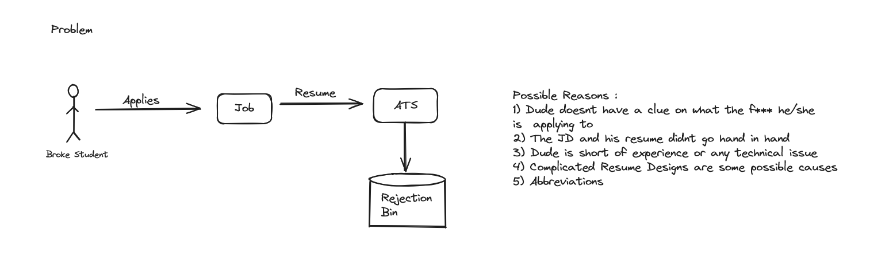
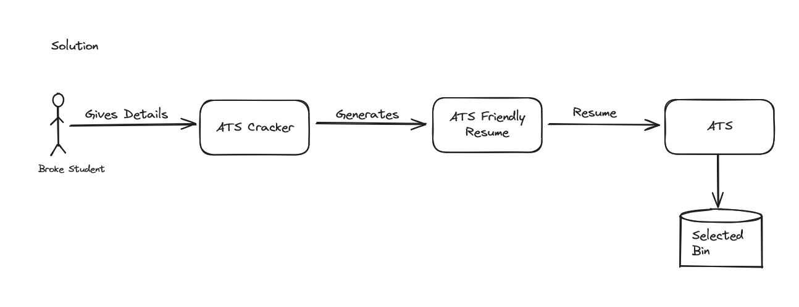

# Project Title
ATS Cracker

## Introduction
ATS Cracker is an GenAI-based tool which helps in creating ATS friendly Resume / CVs, by utilizing the help of Generative AI models, available in the market. Please find more about the application in the following screenshots:

## Features

- gpt-4.o through OpenAI API
- python-docx for file creation

## Conclusion

Thanks for showing interest! If you like the project, Be sure to fork (for future references) or star.